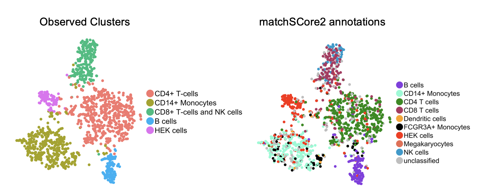
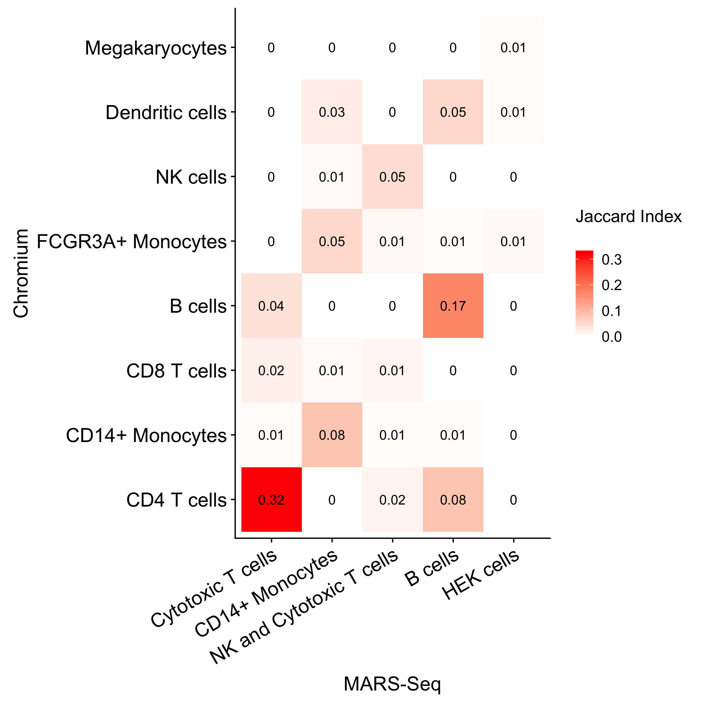

## Quick introduction

MatchSCore2 is a R package for the comparison of single cell RNA-seq data across tools and experiments. The package allows a gene marker-based projection of single cells onto a reference sample and, thus, the identification of cell types in unknown cells.  

## Installation

matchSCore2 is a new version of the older matchSCore package.  
This is a development version running on R (>= 3.5.1). The package makes use of nnet, Matrix, splatter, MixSim and ggplot2 libraries. Other libraries are also used for clustering and identification of markers (e.g. Seurat).

matchSCore2 can be installed by devtools:

```{r,eval=FALSE}

library("devtools")
install_github('elimereu/matchSCore2')


```


## Functionalities of matchSCore2

MatchSCore2 has tree main functions:

1. Annotation of cells throught a supervised classification model based on a reference dataset. (**Cell annotations**) 
2. Measure and visualize the matching between your clusters and clusters from a reference dataset. (**Cluster annotations**) 
3. Track the accuracy trend of a tool in clustering and marker identification compared with the optimal solution provided by a simulated data set. In this case, matchSCore2 works in combination with the Splatter package - https://github.com/Oshlack/splatter/blob/master/vignettes/splatter.Rmd - (**Benchmarking**).

## Usage

To predict cell identities matchSCore2 requires:

1. ``` scale.data ```: A matrix of log-normalized and scaled gene expression values from the reference dataset (similar to the matrix scale.data in Seurat object).
2. ``` clus ```: A named factor with reference identities (similar to @ident slot in Seurat object).
3. ``` gene_cl.ref ```: A named list with markers. Each element of the list contains cell type specific gene markers (Usually top100 ranked markers of each cell type). An example of gene_cl.ref can be 


```{r,eval=FALSE}

library(matchSCore2)
library(nnet)
library(Matrix)

### Training of the model  
mod <- train_model(scale.data = ref@scale.data,clus = ref@ident,gene_cl.ref = gene_cl.ref,prop = 0.75)

## Cell projection
out <- identity_map(scale.data = obs@scale.data,model = mod,gene_cl.ref)

### cell identities
ids <- out$ids 


## To each cell probabilities are assigned for any possible identity class
probabilities <- out$fit.prob


```




## Clustering Annotation

We can also measure the grade of matching across clusters from two considered datasets.
For example, you could use the top 100 ranked markers we got (by using Seurat) from the Chromium and MARS-Seq dataset.
You can load files directly from the data folder in this repository. 

```{r,eval=TRUE}

## We used the Chromium data as reference
load(file="data/gene_cl.ref_Chromium.RData")

## And the MARS-Seq as test
load(file="data/gene_cl_MARS-Seq.RData")


## The matchSCore2 function computes the clustering comparison and produce the heatmap table with Jaccard Indexes for each group combination

ms <- matchSCore2(gene_cl.ref = gene_cl.ref,gene_cl.obs = gene_cl,ylab = "Chromium",xlab = "MARS-Seq")

## The matchSCore heatmap is stored in the ggplot slot of ms. 
ms$ggplot


```



