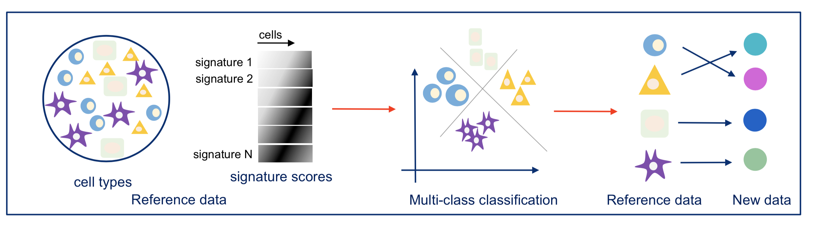
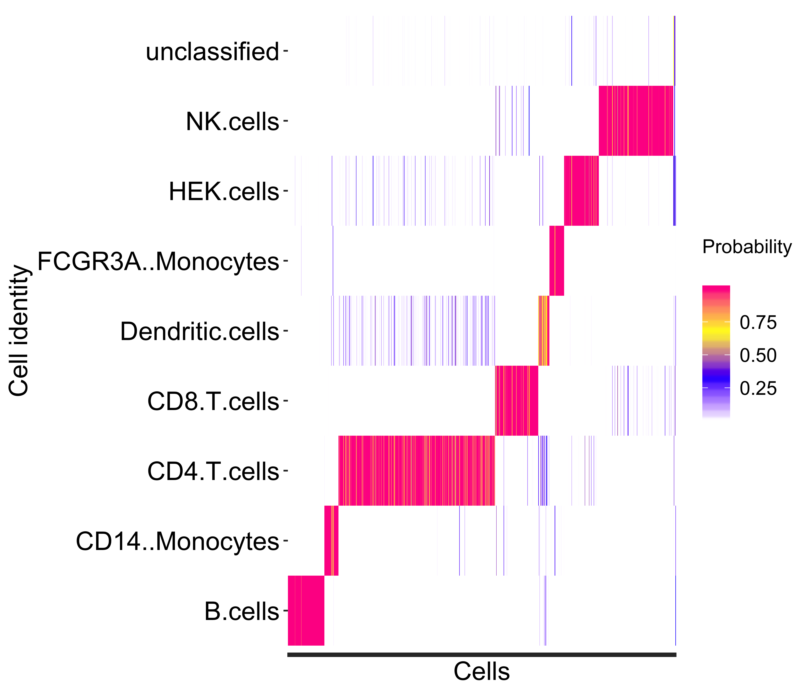
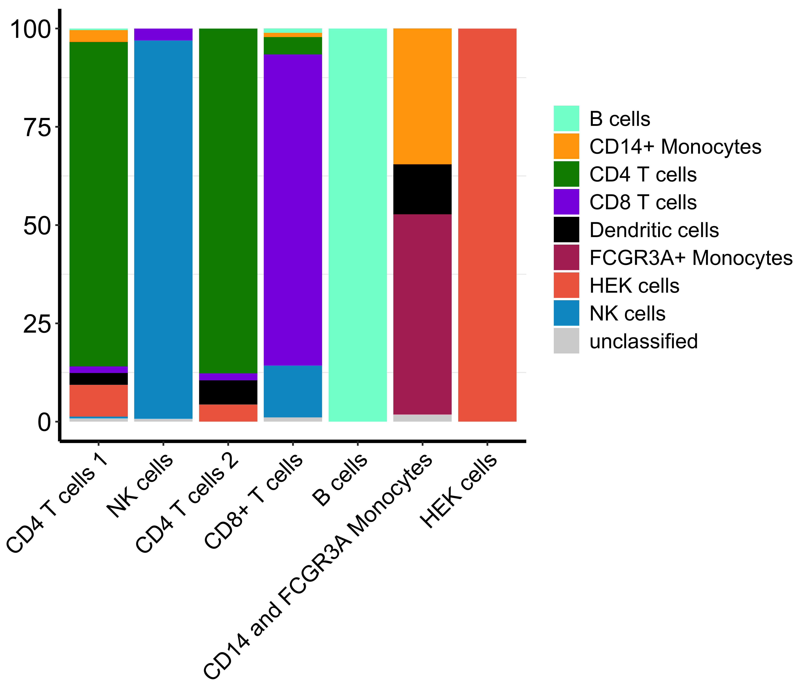
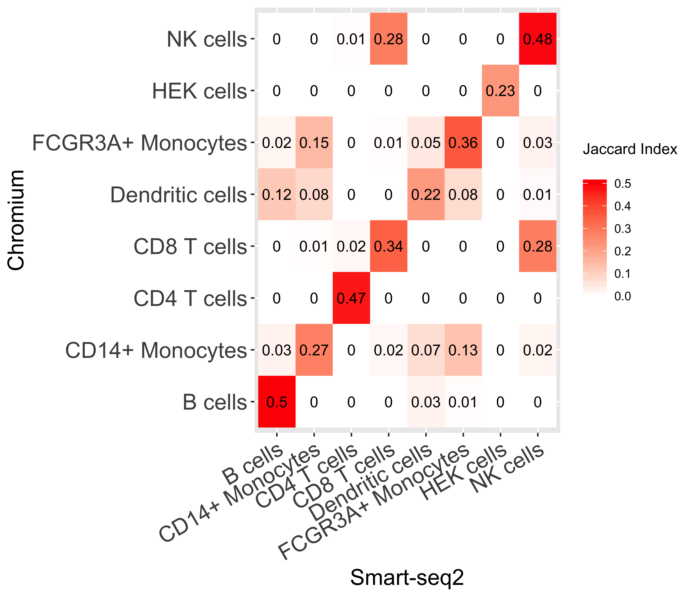
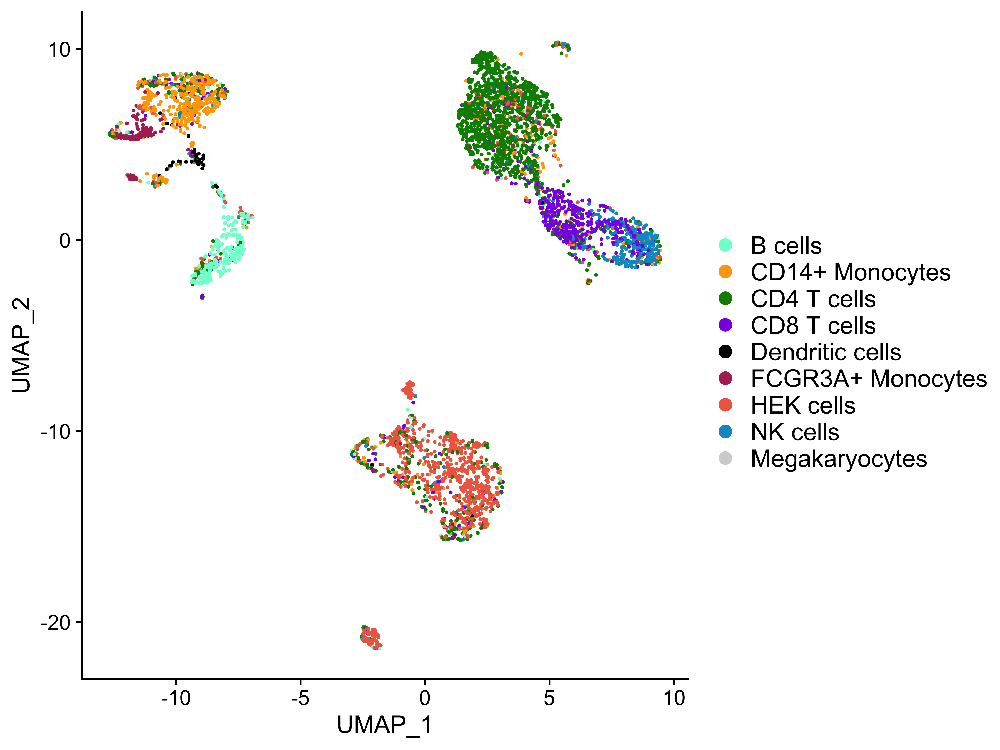
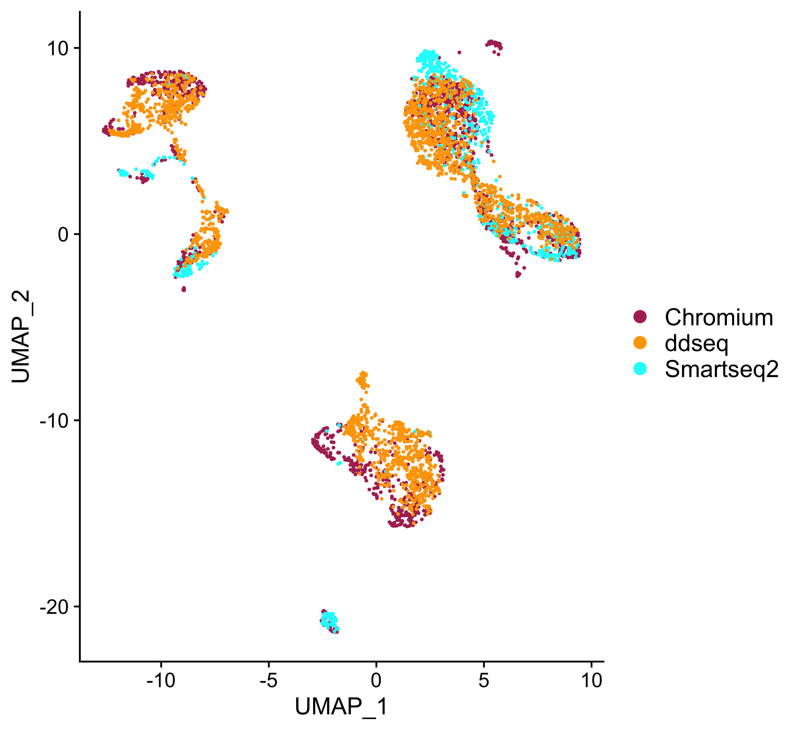
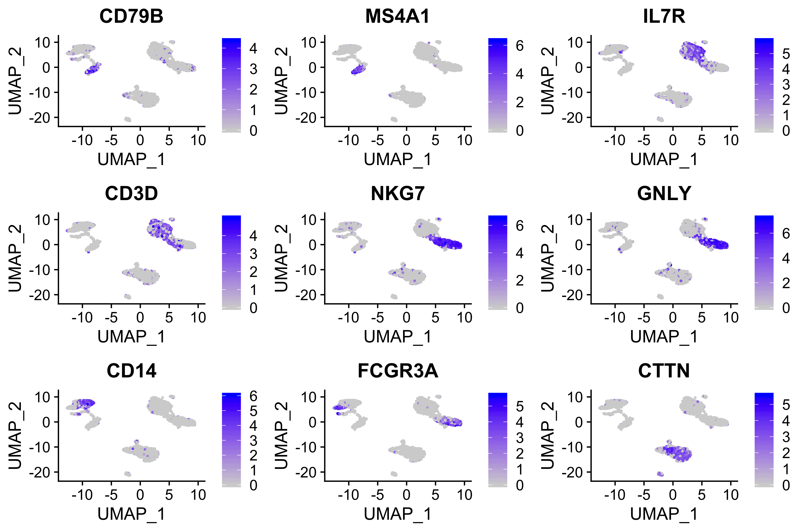

**Compiled date**: `r Sys.Date()`

**Last edited**: 2020-03-26

**License**: `r packageDescription("matchSCore2")[["License"]]`

```{r setup, include = FALSE}
knitr::opts_chunk$set(
  collapse = TRUE,
  comment = "#>",
  error = FALSE,
  warning = FALSE,
  eval = TRUE,
  message = FALSE,
  fig.width = 10,
  fig.height = 8,
  fig.align = "center"
)
options(width = 100)

run_code <- TRUE
```
  
# Introduction {#introduction}

This vignette describes how to use the `r BiocStyle::Biocpkg("matchSCore2")` package for the comparison of single cell RNA-seq data across experiments. 
The package allows a gene marker-based projection of single cells onto a reference sample and, thus, the identification of cell types in unknown cells. TODOELI: rather "in new datasets of unknown composition"?
A more detailed version of the method is at the bioRxiv paper: http://dx.doi.org/10.1101/630087 [@Mereu2019]. 
By using a reference dataset in which the cellular type of individual cells is defined and gene markers are computed, `r BiocStyle::Biocpkg("matchSCore2")` trains a multinomial logistic model to classify unknown cells in new datasets from similar tissues. 

The method consists of the following steps:

1. The reference dataset is subset in two parts, train and test data, in order to estimate the accuracy of the model. []TODOELI: did you ever investigate whether e.g. k fold cross-validation could help?
2. For each cell type in the reference, a signature score is assigned to each cell by using the top 100 gene markers. []TODOELI: could this be adjusted? if so, we can say "top N (default N = 100)"
3. The signature scores are the predictors of the multinomial logistic model.
4. Once the model is trained, a probability value is assigned to each cell per cell type. 
   The highest likelihood can then be used to annotate that cell if it reaches the minimum value provided by the user (default = 0.5).    

```{r ss-overview, echo=FALSE, eval=run_code, fig.wide = TRUE}

```
    
# Getting started {#gettingstarted}

To install this package, start R and enter:

```{r install, eval=FALSE}
if (!requireNamespace("BiocManager", quietly = TRUE)) {
  install.packages("BiocManager")
}

BiocManager::install("matchSCore2")

# the development version is available also on GitHub
BiocManager::install("elimereu/matchSCore2")
```

Once installed, the package can be loaded and attached to your current workspace as follows:

```{r loadlib,eval=run_code}
library("matchSCore2")
```

In this vignette, we showcase the functionality of `r BiocStyle::Biocpkg("matchSCore2")` using the PBMC+HEK293T data from our benchmarking of 13 protocols [@Mereu2019]. 
The list of all seurat objects, including UMAPs and tSNEs are provided here: https://www.dropbox.com/sh/wgu6kcioqkkva4g/AABHJaFsiqYZeYc-xv6qtg3ba?dl=0. 

[]TODOELI: this is quite huge. IMHO it makes much much sense to have this in EHub. Or even better, have it "componible" with the pieces found in EHub

From the same link, you can also download the `SingleCellExperiment` object from which you can extract the counts from each protocol by following the instructions below.

```{r, message=FALSE, warning=FALSE, eval=run_code}
library("SingleCellExperiment")
```


```{r, message=FALSE, warning=FALSE, eval=FALSE}
url <- "https://www.dropbox.com/s/lrfoux7uxundcy1/sce.all_classified.technologies.RData?raw=true"
download.file(url = url, destfile = "~/Downloads/sce.all_classified.technologies.RData", mode = "wb")
```

```{r, message=FALSE, warning=FALSE, eval=run_code}
load(file = "sce.all_classified.technologies.RData") ## load the data
```

After you load it into R, if you check the `colData(object)` there are three metadata, which are: `nnet2`, `ident`, and `batch`.

1. `nnet2` is the annotation from the `MatchSCore2()` classifier. 
2. `ident` is the Seurat clustering result. The clusters are manually annotated by looking at the expression of known gene markers.
3. `batch` is the sequencing protocol. 

```{r,eval=run_code}
sce
colData(sce) ### give access to the metadata DataFrame

table(colData(sce)$nnet2) ## Number of cells from each classified cell type (by matchSCore2)
table(colData(sce)$ident) ## Number of cells from each Seurat cluster
table(colData(sce)$batch) ## Number of cells from each protocol

# or as a shortcut
table(sce$batch)
```

You can extract counts (raw or log-normalized), PCA, and UMAP of the integrated dataset, by the following commands:

```{r eval=run_code}
counts <- counts(sce)
logcounts <- logcounts(sce)

umap <- reducedDim(sce, "UMAP")
pca <- reducedDim(sce, "PCA")

## if you are interested in a specific protocol (e.g. Chromium)
sce_chromium <- sce[, sce$batch == "Chromium"]
logcounts_chromium <- logcounts(sce_chromium)
```

In case you are interested in working with the seurat objects, all datasets are in the `data.list` list, whose elements represent the protocols. 

[]TODOELI: I think again it would be super cool to have a- them on EHub, and b- while we are at it, my suggestion is that on EHub they would belong stored as SingleCellExperiment objects

Let us suppose Chromium is the reference and Smart-seq2 the test data we want to annotate. 
The cell type specific markers from each protocol are also provided.

```{r eval=run_code}
library("Seurat")
```

```{r eval=FALSE}
url <- "https://www.dropbox.com/s/2ketqbof6tvnv07/data.list_seurat.obj_all_datasets.RData?raw=true"
download.file(
  url = url,
  destfile = "data.list_seurat.obj_all_datasets.RData",
  mode = "wb"
)
```

```{r eval=run_code}
# NOTEELI: this looks like the perfect case to provide these objects via EHub
##### load(file = "data.list_seurat.obj_all_datasets.RData")
##### ref <- data.list$Chromium
##### nnet2 <- ref$nnet2
##### smartseq2 <- data.list$`Smart-Seq2`
##### 
##### rm(data.list) # to avoid having too large object loaded!

ref <- readRDS("datalist_chromium.rds")
nnet2 <- ref$nnet2
smartseq2 <- readRDS("datalist_chromium.rds")
```

# Training the model

To train the multinomial logistic model implemented in `r BiocStyle::Biocpkg("matchSCore2")`, we use the function `ms_train_model`, which requires the following inputs:

1. `scale.data`: A matrix of log-normalized or scaled gene expression values from the reference dataset (in the manuscript we used the scale.data slot in the seurat objects. 
   Make sure that the markers are all included in the scale.data).
2. `clus`: A named factor with reference identities (like in the "ident" slot in the Seurat object).
3. `gene_cl.ref`: A named list of markers. 
   Each element of the list contains cell type specific gene markers (Usually top100 ranked markers of each cell type). 
   If you have the output of `FindAllMarkers` from Seurat, you could use the `ms_top_markers` function to get `gene_cl.ref`.


```{r eval=run_code}
library("matchSCore2")
library("nnet")
```


```{r eval=FALSE}
url <- "https://www.dropbox.com/s/wijdjhbm17fd7fp/markers_all_datasets.RData?raw=true"
download.file(url = url, destfile = "markers_all_datasets.RData", mode = "wb")
```


```{r eval=run_code}
load(file = "markers_all_datasets.RData")
ref.markers <- markers$Chromium

gene_cl.ref <- ms_top_markers(levels(ref.markers$cluster),
  markers = ref.markers,
  ntop = 100
)

# TODO there's no accessor available in Seurat?!
scaled <- ref@assays$RNA@scale.data
```

### Training of the model

```{r eval=run_code}
mod <- ms_train_model(
  scale.data = scaled, 
  clus = nnet2,
  gene_cl.ref = gene_cl.ref,
  prop = 0.5
)
mod
```

## Cell classification

Once the model has been calculated, it can be used to predict the identity of unknown cells from another dataset. 
Here, we will test the model in MARS-seq data. 
With the function `ms_identity_map`, we assign the cell identity in the test data based on the highest probability predicted by the model.

```{r eval=run_code}
scaled <- ScaleData(smartseq2, features = unlist(gene_cl.ref))
scaled <- scaled@assays$RNA@scale.data # TODOELI: are there no accessors in Seurat to do so?

## Cell projection
out <- ms_identity_map(
  scale.data = scaled,
  model = mod,
  gene_cl.ref = gene_cl.ref
)

ms_identity_heatmap(out)
```

```{r ss-identityheat, echo=FALSE, eval=run_code, fig.wide = TRUE}

```

From the heatmap, you can observe the probability of cells to be assigned to each cell identity.
Cells assigned to a specific identity have the highest probability (magenta color) for that class and probability close to zero (white-blue colors) in other classes.   

## Comparison between `matchSCore2` and clustering annotations

`r BiocStyle::Biocpkg("matchSCore2")` can be used to improve the clustering annotation, detecting subtle differences between cell types that are difficult to be detected by clustering (e.g. NK and CD8 T cells, CD4 and CD8 T cells, etc..). 

```{r eval=run_code}
smseq.clus <- smartseq2$ident

col <- c("aquamarine", "orange", "green4", "blueviolet", "black", "maroon", "coral2", "deepskyblue3", "lightgray")

library("ggplot2")
ms_summary_barplot(class.fac = out$ids, obs.fac = smseq.clus) +
  scale_fill_manual(values = col)
```

```{r ss-barplots, echo=FALSE, eval=run_code, fig.wide = TRUE}

```

Here, you can see the distribution of the assigned cell identities per cluster. 
This is helpful to visualize the agreement between clustering and cell identity projection. 
Also, it highlights differences in cluster resolution (e.g. the cluster of monocytes contains both types CD14+ and FCGR3A+).

# Clustering Annotation

We can also measure the grade of matching across clusters by looking at the level of similarity of their cluster-specific gene markers, measured by the Jaccard Index. 
For example, you could use the top 100 ranked markers per cluster from the Chromium and MARS-Seq dataset.

```{r eval=run_code}
## And the MARS-Seq as test
test.markers <- markers$`Smart-Seq2`

gene_cl.test <- ms_top_markers(levels(test.markers$cluster), markers = test.markers, ntop = 100)

head(gene_cl.test)

## The matchSCore2 function computes the clustering comparison and produce the heatmap table with Jaccard Indexes for each group combination

ms_res <- matchSCore2(gene_cl.ref = gene_cl.ref, 
                      gene_cl.obs = gene_cl.test, 
                      xlab = "Smart-seq2",
                      ylab = "Chromium")
names(ms_res)
```

```{r ss-clustercomp, echo=FALSE, eval=run_code, fig.wide = TRUE}

```

In the heatmap, we can observe the Jaccard similarity between cluster-specific markers from the two experiments. 
Notably, you can see how the Jaccard indexes between markers reflect the cellular composition of clusters, in agreement with the previous plot. 

# Alignment of datasets

While with the previous approach we can quickly transfer annotations from one dataset to another, sometimes we are interested in comparing gene measurements between cells coming from different experimental conditions (e.g. WT vs KO, disease vs control, different protocols, etc..). 
In the `r BiocStyle::Biocpkg("matchSCore2")` package, we provide a mathematical framework to align datasets, by projecting them to the same coordinate space of an assigned reference dataset. 

The method is based on the single value decomposition and allows a direct comparison of datasets, by finding the optimal linear transformation between data points.     
By using the function `ms_integrate`, two or more gene expression matrices are compared and aligned to the same reference dataset.  

In this example, we want to align 3 of the PBMC+HEK293T experiments sequenced with different protocols: Chromium, Smart-Seq2 and ddSEQ. 
In this case, the choice of the reference is not so important, we will choose the Chromium dataset.
The method requires the clusters (more than 1 cell), they will be used to compute a centroid point at each dataset, useful for their comparison. 
<!-- TODOELI: unclear sentence here above -->

```{r, eval=FALSE}
url <- "https://www.dropbox.com/s/lrfoux7uxundcy1/sce.all_classified.technologies.RData?dl=0"
download.file(url = url, destfile = "sce.all_classified.technologies.RData", mode = "wb")
```


```{r, eval=run_code}
# load(file = "sce.all_classified.technologies.RData") ## load the data

sce_chromium <- sce[, sce$batch == "Chromium"]
sce_smartseq2 <- sce[, sce$batch == "Smart-Seq2"]
sce_ddseq <- sce[, sce$batch == "ddSEQ"]

sce_chromium$cluster <- factor(sce_chromium$nnet2)
sce_smartseq2$cluster <- factor(sce_smartseq2$nnet2)
sce_ddseq$cluster <- factor(sce_ddseq$nnet2)

list_data <- list(Chromium = sce_chromium, Smartseq2 = sce_smartseq2, ddseq = sce_ddseq)

markers.dds <- markers$ddSEQ
gene_cl.dds <- ms_top_markers(levels(markers.dds$cluster), 
                              markers = markers.dds, 
                              ntop = 100)

markers_list <- unique(c(unlist(gene_cl.ref), unlist(gene_cl.test), unlist(gene_cl.dds)))

out_align <- ms_integrate(dataset_list = list_data, marker_list = markers_list, ref = "Chromium")
# TODOELI: this one up here returns an error - can you double check this by running the vignette as a whole till here?
```

The output contains a `SingleCellExperiment` object with the joint raw counts and the integrated matrix from the 3 datasets. 
See the manual of the `ms_integrate` function for more details about the output.

Once the datasets are integrated, you can use the normalized matrix to cluster your cells. 
For example, if you want to use Seurat, you can provide that matrix in the `@data` slot, as in the `ms_runseurat` function. 

```{r, eval=run_code}
col2 <- c("maroon", "orange", "cyan")
out_seurat <- ms_runseurat(
  out_align = out_align,
  dims = 1:10,
  res = 0.2,
  col_anno = col,
  col_data = col2
)

DimPlot(out_seurat, group.by = "cluster", cols = col) +
  theme(legend.text = element_text(size = 14))

DimPlot(out_seurat, group.by = "dataset", cols = col2) +
  theme(legend.text = element_text(size = 14))
```

```{r ss-umapcelltype, echo=FALSE, eval=TRUE, fig.wide = TRUE}

```

```{r ss-umapafter, echo=FALSE, eval=TRUE, fig.wide = TRUE}

```

We can explore some of the markers we used for the integration with the Seurat `FeaturePlot` function:

<!-- TODOELI: We should stick to sce outputs and inputs + use for example here plotExpression from scater, which does the same de facto -->

```{r, eval=run_code}
FeaturePlot(out_seurat, features = c(
  "CD79B", "MS4A1", "IL7R", 
  "CD3D", "NKG7", "GNLY", 
  "CD14", "FCGR3A", "CTTN"
))
```

```{r ss-umapmarkers, echo=FALSE, eval=TRUE, fig.wide = TRUE}

```

# Session Info {-}

```{r sessioninfo}
sessionInfo()
```

# References {-}
